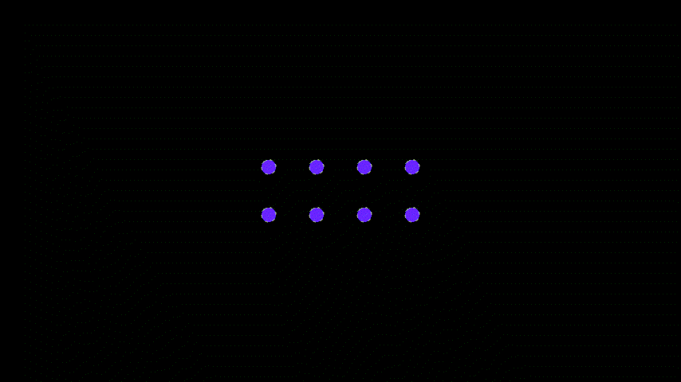
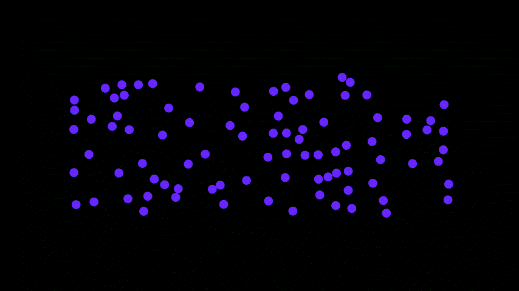
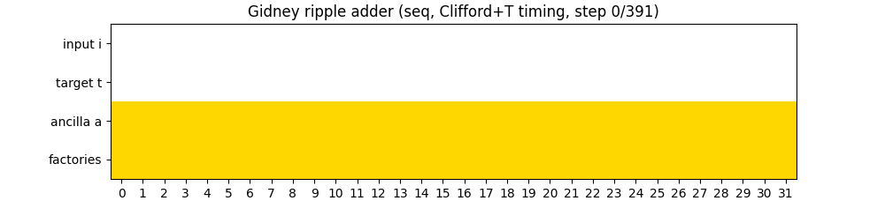

### **Summary**

- Practice the geometric mapping of quantum circuits or large-scale algorithms to neutral-atom shuttling.
- Build animations that illustrate circuits, compilation strategies, or algorithmic gadgets.
- Explore alternative artistic expressions visualizing quantum programs using animation toolchains such as Manim.

## **Narrative**

Visual animations are powerful vehicles for illustrating the operation of computing architectures highlighting geometric and temporal constraints, and showing how compilation strategies reshape programs. Such visualizations also play a central role in supporting debugging, validation, and bridging general audiences with the complexity of computing.

This challenge tasks you with engaging and developing new ideas for visual design practices to explain compilation and algorithm execution on neutral-atom quantum hardware. You will practice how to translate high-level circuit logic into a visual narrative that emphasizes data flow, modular subroutines, and hardware-aware compilation decisions to support developers and to make quantum computing more accessible to diverse audiences beyond the quantum community.

## **Step 1: pick your tools**

There are many tools that can be used for creating animations, both in 2D and 3D. From highly manual tools in the Blender family (see e.g. [this](https://www.bforartists.de/) or [this](https://www.sidefx.com/products/houdini-apprentice/); [some teams](https://quantumcomputing.stackexchange.com/questions/5280/reference-that-explains-how-to-read-3d-topological-diagrams-for-surface-code-com) like to use 3D modeling tools such as [SketchUp](https://sketchup.trimble.com/en) to showcase surface-code topological diagrams), including tools that can easily be used in conjunction with ipads (e.g. [Procreate](https://procreate.com/)), to more programmatic tools such as [Matplotlib](https://matplotlib.org/) itself. Pick whichever tool you have access to and familiarity with, and that you think can serve your goals best. 

A potentially simple starting point, if you are just getting started with animations today, is to try your hands on the [Quantum Animation Toolbox](https://github.com/jwaldorf05), developed by Jonathan Waldorf, one of QuEra’s former interns. This toolbox runs on top of [Manim](https://github.com/3b1b/manim) (famous YouTuber 3b1b’s math animation engine) and has a suite of pre-defined functions and methods adapted for neutral-atom quantum computing context. Note, however, that the Quantum Animation Toolbox may not be closely maintained, nor be fully documented.

## **Step 2: pick your quantum algorithm or circuit**

There are many classes of quantum algorithms with interesting structure to represent: arithmetic circuits, quantum error correction circuits, graph-based circuits, and so on. Similarly, there are many different properties of the circuit that may be of interest to visualize: abstract circuit transformations showcasing logic compilation choices, actual coordination of atoms while the circuit runs, the coordination of logical circuit blocks. 

Likewise, one should consider the degree of detail as function of the scale of the algorithm you’d like to showcase: representing all details of what atoms are doing when performing a full compilation of Shor’s algorithm at RSA-2048 scale might not be possible, particularly if you want to include all steps of error correction given a code choice. 

A good warm-up exercise could be to reproduce the atom shuttling animations from QuEra’s [2024 Logic Magic State Distillation](https://www.nature.com/articles/s41586-025-09367-3) work; see a record such shuttling moves, using real atoms, [here](https://youtu.be/4MWFNVhbvho?t=1394). Some interesting static images that could be animated for large-scale protocols can be found [here](https://arxiv.org/abs/2505.15907v1).

## **Step 3: animate!**

Now build your animation! Make your artistic choices and polish how you want to represent and analyze your quantum circuit! Here are some simple examples put together by QuEra’s team! Feel free to ask questions to help you think what would be most interesting to showcase:

Entangling atoms in parallel

Deterministic loading of atoms

32-bit Ripple Carry Adder with measurement-based uncompute on a surface code

Native gate-set circuit compilation

Magic State distillation on distance 5 color code

